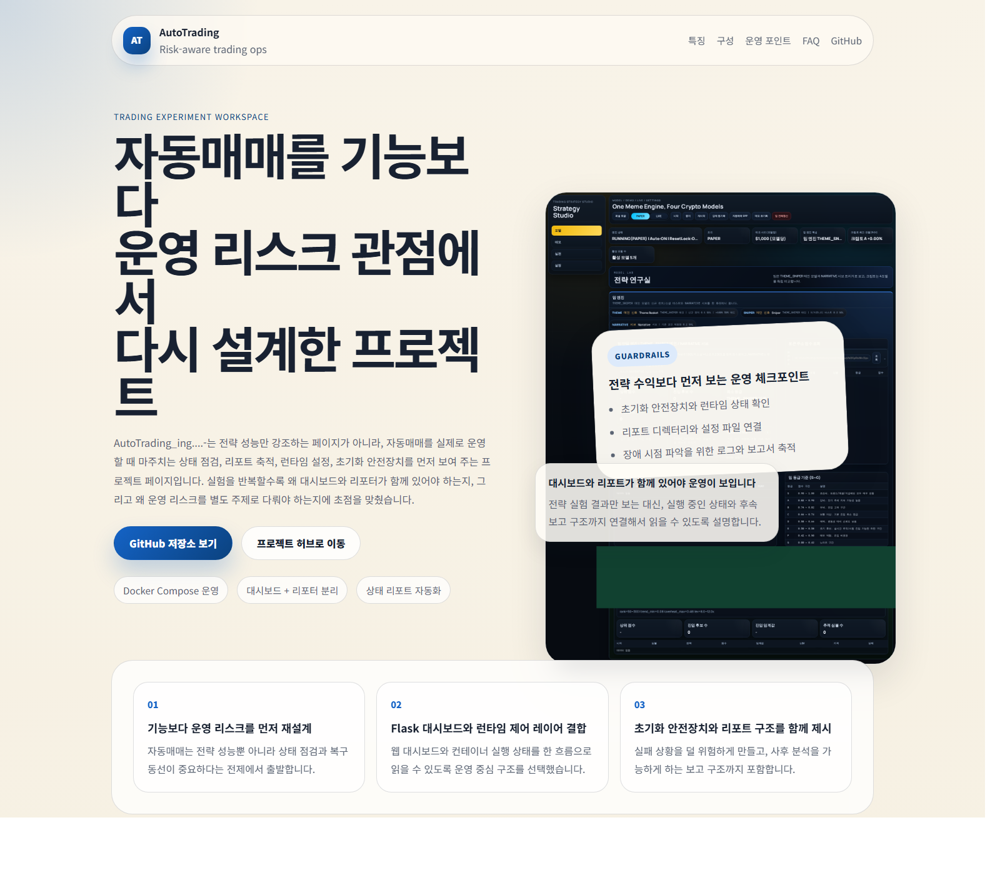

# AI_Auto

Execution-first crypto trading lab focused on planner-based entries, daily PnL persistence, and weekly autotune.



## What This Repo Is Now

As of `2026-03-15`, the project is being reshaped around a simpler operating profile:

- `meme` flow removed from the active trading direction
- `Top 5` major Bybit pairs only: `BTCUSDT`, `ETHUSDT`, `SOLUSDT`, `XRPUSDT`, `BNBUSDT`
- `4` crypto planner models that generate `entry / SL / TP`
- `10-minute` analysis cycle
- `daily` model PnL snapshots and git report files
- `weekly` parameter autotune based on accumulated results

This repository is not trying to look like a generic AI-generated trading demo. The direction is an operations-grade trading lab: signal planning, execution discipline, reporting, and parameter feedback loops.

## Current Trading Profile

| Item | Current direction |
| --- | --- |
| Market | Crypto majors only |
| Universe | `BTCUSDT`, `ETHUSDT`, `SOLUSDT`, `XRPUSDT`, `BNBUSDT` |
| Cycle | Every `10m` |
| Leverage band | `15x ~ 30x` by model |
| Models | `A/B/C/D` planner models |
| Review layer | No LLM review |
| Learning loop | Daily PnL + weekly autotune |
| Reports | `reports/daily_pnl/*.json`, `*.csv`, `summary.csv` |

## Model Matrix

| Model | Role | Planning output |
| --- | --- | --- |
| `A` | Range reversion planner | mean reversion entry zone, defensive stop, staged targets |
| `B` | Support reclaim planner | reclaim entry, invalidation stop, recovery targets |
| `C` | Compression breakout planner | breakout retest entry, range stop, expansion targets |
| `D` | Reset bounce planner | washout bounce entry, reset stop, rebound targets |

All four models are expected to output:

- `entry_price`
- `entry_zone_low`
- `entry_zone_high`
- `stop_loss_price`
- `target_price_1/2/3`
- `risk_reward`
- `recommended_leverage`
- `setup_expiry_ts`

## Operating Loop

1. Every `10 minutes`: generate fresh crypto setups for the fixed top-5 universe.
2. Every `24 hours`: aggregate model-level daily PnL and persist report files.
3. Every `7 days`: adjust thresholds and TP/SL multipliers from observed performance.

This is the core loop. No narrative review layer is required for it.

## Runtime and Deployment Direction

### Current runtime

- `Flask` still exists for local diagnostics, but the cloud direction is now a service console plus batch runner split.
- The batch runner can hydrate runtime config and provider credentials from Supabase before executing.
- GitHub Pages is used for the public-facing project landing.

### Target cloud split

- `Vercel`: dashboard + operator console
- `Supabase`: setups, positions, daily PnL, autotune history, heartbeat, encrypted provider vault, runtime config blob
- `GitHub Actions`: `10m` analysis, daily report commit, weekly autotune
- `Python engine`: batch-oriented execution layer that fetches config and keys from Supabase at runtime

Useful files:

- [Core Supabase schema](docs/SUPABASE_CORE_SCHEMA_20260315.sql)
- [Vercel and Supabase setup checklist](docs/VERCEL_SUPABASE_SETUP_20260315.md)
- [Strategy refactor notes](docs/strategy_refactor_20260308.md)

## Quick Start

### Local Python

```powershell
cd d:\AI_Auto
py -3 -m venv .venv
.venv\Scripts\Activate.ps1
pip install -r requirements.txt
Copy-Item .env.example .env
Copy-Item runtime_settings.example.json runtime_settings.local.json
py -3 web_app.py
```

### Docker

```powershell
cd d:\AI_Auto
Copy-Item .env.example .env
docker compose up -d --build
```

Default local dashboard:

```txt
http://localhost:8099
```

## Repository Map

- `src/`: engine, config, providers, runtime feedback, reporting
- `web_app.py`: Flask app entrypoint
- `templates/`, `static/`: current dashboard UI
- `docs/`: GitHub Pages landing, setup notes, strategy documents
- `reports/`: generated runtime and daily report outputs
- `scripts/`: local maintenance and helper scripts

## Safety Notes

- `runtime_settings.local.json` and `.env` are local runtime files and should stay out of git.
- `publishable` Supabase keys can be used in the frontend.
- `secret` or `service_role` keys must stay server-side only.
- The current design direction assumes no LLM review dependency for the core trading loop.

## GitHub Pages

The GitHub Pages source lives under `docs/`.
The landing page is intentionally separate from the Flask dashboard UI so the repository presentation does not look like a duplicated app shell.

## Status

Active focus right now:

- planner-based crypto execution
- daily PnL reporting
- weekly autotune
- Supabase persistence
- Vercel frontend split
