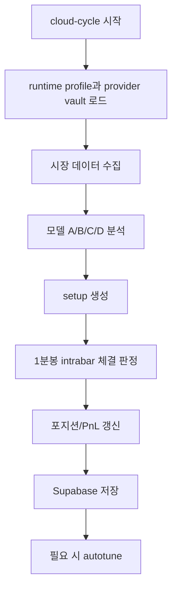

# 실행 흐름

현재 AI_Auto는 8분 배치 기반의 futures demo 운영 루프를 기준으로 돌아갑니다.

## 전체 흐름

| 순서 | 단계 | 결과 |
| --- | --- | --- |
| 1 | GitHub Actions `cloud-cycle` 실행 | 8분 주기 배치 시작 |
| 2 | Supabase에서 runtime profile과 provider vault 로드 | 실행 기준과 provider 자격증명 확보 |
| 3 | Top 5 메이저 코인 선물 데이터 수집 | 모델 입력 데이터 준비 |
| 4 | 4개 planner 모델 분석 수행 | setup 후보 생성 |
| 5 | setup 생성 | entry / stop / target / confidence 기록 |
| 6 | 최근 8분 구간의 1분봉으로 intrabar 체결 여부 판정 | entry / TP / SL 체결 반영 |
| 7 | 포지션과 일별 PnL 갱신 | 모델별 손익과 상태 갱신 |
| 8 | Supabase에 결과 저장 | 콘솔 화면 갱신 준비 |
| 9 | 주간 autotune 시점이면 파라미터 조정 | 다음 사이클 기준 조정 |

## 실행 흐름 다이어그램

> 이 루프는 실시간 틱 엔진이 아니라 8분 배치 기준으로 안정적으로 운영할 수 있는 데모 흐름을 목표로 합니다.

## planner 모델이 만드는 값

각 모델은 최소한 아래 값을 만듭니다.

- entry price
- entry zone
- stop loss
- target price 1 / 2 / 3
- confidence
- leverage profile

## intrabar 체결이 필요한 이유

배치 시점 현재가만 보면, 배치 사이 구간에서 실제로 entry / TP / SL을 찍고 지나간 경우를 놓칠 수 있습니다. 그래서 최근 8분 구간은 1분봉 high / low를 다시 읽어 아래를 판정합니다.

- entry 터치 여부
- entry 이후 TP / SL 터치 여부
- 같은 캔들 충돌 시 어떤 규칙으로 처리할지

## 충돌 규칙

현재 지원 규칙:

- `conservative`: SL 우선
- `neutral`: open 기준 더 가까운 쪽 우선
- `aggressive`: TP 우선

이 규칙은 `/settings`에서 저장되며, 포지션 로그 해석에 직접 영향을 줍니다.

## 배치가 정상인지 보는 체크리스트

- [ ] `engine_heartbeat.last_seen_at`가 최근 8분 내에 갱신된다
- [ ] `model_setups`에 최신 cycle 데이터가 쌓인다
- [ ] `positions` 또는 포지션 로그가 intrabar 결과를 반영한다
- [ ] `daily_model_pnl`이 일별로 계속 누적된다
- [ ] autotune 주기 전에는 파라미터가 불필요하게 흔들리지 않는다
