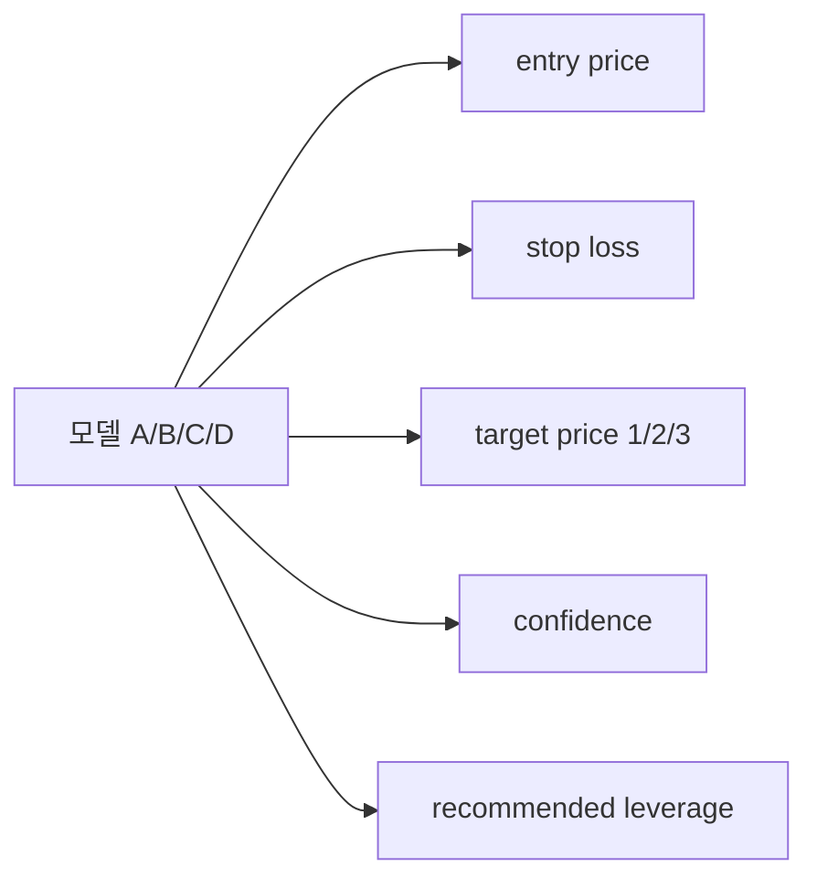

# 모델과 리스크 기준

현재 AI_Auto는 crypto futures demo를 기준으로 4개의 planner 모델을 운영합니다. 각 모델은 점수만 내는 구조가 아니라 entry, stop loss, target price를 직접 제안합니다.

## 모델 요약

| 모델 | 이름 | 주로 보는 상황 | 권장 레버리지 프로필 |
| --- | --- | --- | --- |
| A | 레인지 리버전 | 과매수·과매도 이후 평균 회귀 | `5x ~ 9x` |
| B | 리클레임 | 스윕 이후 reclaim 회복 | `8x ~ 14x` |
| C | 압축 돌파 | 변동성 수축 이후 breakout retest | `14x ~ 25x` |
| D | 리셋 바운스 | 실패한 돌파 이후 반대 방향 복귀 | `6x ~ 12x` |

## 모델 출력 다이어그램

> 네 모델은 점수만 내는 구조가 아니라 실제 포지션 계획을 만들기 위한 값들을 함께 제안합니다.

## 모델별 해석

### A. 레인지 리버전

- 과열 구간에서 되돌림과 평균 회귀를 노립니다
- 진입은 과확장 이후 회복 구간을 중심으로 잡습니다
- stop은 range 이탈 기준으로 둡니다

### B. 리클레임

- 유동성 스윕 이후 reclaim이 확인되는 구간을 봅니다
- reclaim 확인가를 중심으로 진입 계획을 만듭니다
- 손절은 reclaim 실패 기준으로 둡니다

### C. 압축 돌파

- 변동성 수축이 길게 이어진 이후 확장을 봅니다
- breakout retest가 확인되면 공격적으로 진입합니다
- 타깃은 box height와 확장 구간을 함께 봅니다

### D. 리셋 바운스

- 실패한 돌파 이후 반대 방향 복귀 흐름을 다룹니다
- 무효화 이후 다시 정상 range로 돌아오는 구간을 활용합니다
- stop은 실패 시나리오가 다시 유효해지는 지점에 둡니다

## 모델이 만드는 값

각 모델은 최소한 아래 값을 만듭니다.

- `entry_price`
- `entry_zone_low / high`
- `stop_loss_price`
- `target_price_1 / 2 / 3`
- `confidence`
- `recommended_leverage`

## futures demo 리스크 기준

| 항목 | 기준 |
| --- | --- |
| 모델별 시드 | `10000 USDT` |
| 최대 동시 포지션 수 | `3` |
| 진입 비중 | `10% ~ 30%` |
| 전체 레버리지 범위 | `5x ~ 25x` |

## confidence와 진입 비중

현재 구조에서는 confidence가 높을수록 진입 비중이 상단 범위에 가까워지도록 해석합니다. 다만 과대 진입을 막기 위해 runtime profile에서 최소/최대 진입 비중을 따로 제한합니다.

## 운영 체크리스트

- [ ] 모델별 역할이 겹치지 않는지 확인한다
- [ ] 레버리지 프로필이 futures demo 기준을 넘지 않는지 확인한다
- [ ] entry / stop / target 구조가 현재 시장보다 과도하게 촘촘하지 않은지 본다
- [ ] confidence 해석이 곧바로 과대 포지션으로 이어지지 않도록 진입 비중 상한을 둔다
