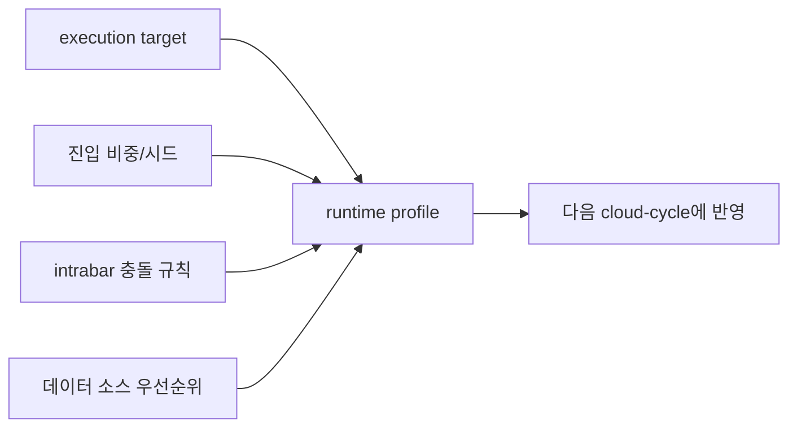

# 런타임 설정 레퍼런스

> [Prev: Execution Flow](https://github.com/sheryloe/Automethemoney/wiki/Execution-Flow) | [Wiki Home](https://github.com/sheryloe/Automethemoney/wiki) | [Next: Models and Risk](https://github.com/sheryloe/Automethemoney/wiki/Models-and-Risk)

---

이 문서는 `/settings`에서 저장하는 runtime profile이 실제로 어떤 의미인지 빠르게 확인하기 위한 레퍼런스입니다.

## 기본값

| 키 | 기본값 | 의미 |
| --- | --- | --- |
| `EXECUTION_TARGET` | `paper` | 실행 타깃. 기본은 paper |
| `TRADE_MODE` | `paper` | 현재 운영 모드 |
| `DEMO_SEED_USDT` | `10000` | 모델별 futures demo 기준 시드 |
| `SCAN_INTERVAL_SECONDS` | `60` | 1분 배치 주기 |
| `SIGNAL_COOLDOWN_MINUTES` | `10` | 연속 진입을 막는 쿨다운 |
| `MODEL_AUTOTUNE_INTERVAL_HOURS` | `168` | 주간 autotune 주기 |
| `INTRABAR_CONFLICT_POLICY` | `conservative` | 같은 캔들에서 TP/SL 충돌 처리 기준 |
| `BYBIT_SYMBOLS` | 운영에서 지정 | 추적 심볼 목록 |
| `CRYPTO_DATA_SOURCE_ORDER` | `binance,bybit,coingecko` | 시장 데이터 우선순위 |

## 설정 관계 다이어그램

## 실행 관련 항목

| 항목 | 선택값 | 설명 |
| --- | --- | --- |
| `EXECUTION_TARGET` | `paper`, `bybit-live` | 실행 타깃 선택 |
| `ENABLE_AUTOTRADE` | `true`, `false` | 자동 매매 루프 사용 여부 |
| `ENABLE_LIVE_EXECUTION` | `true`, `false` | live 실행 플래그 |
| `LIVE_ENABLE_CRYPTO` | `true`, `false` | crypto live 활성화 |
| `LIVE_EXECUTION_ARMED` | `true`, `false` | 실제 live 전환 전 마지막 arm 단계 |

## 리스크 관련 항목

| 항목 | 현재 기준 | 설명 |
| --- | --- | --- |
| `DEMO_SEED_USDT` | `10000` | 모델별 기준 시드 |
| `DEMO_ORDER_PCT_MIN` | `0.10` | 최소 진입 비중 |
| `DEMO_ORDER_PCT_MAX` | `0.30` | 최대 진입 비중 |
| `MAX_OPEN_POSITIONS` | `3` | 최대 동시 포지션 수 |

## 데이터 소스 관련 항목

| 항목 | 기본값 | 의미 |
| --- | --- | --- |
| `CRYPTO_USE_BINANCE_DATA` | `true` | Binance 데이터를 사용할지 |
| `CRYPTO_USE_BYBIT_DATA` | `true` | Bybit 데이터를 사용할지 |
| `CRYPTO_USE_COINGECKO_DATA` | `true` | CoinGecko 데이터를 사용할지 |
| `CRYPTO_DATA_SOURCE_ORDER` | `binance,bybit,coingecko` | 데이터 소스 우선순위 |

## intrabar 충돌 규칙

| 규칙 | 의미 | 기본값 여부 |
| --- | --- | --- |
| `conservative` | SL 우선 | 기본값 |
| `neutral` | 캔들 open 기준 더 가까운 쪽 우선 | 선택 가능 |
| `aggressive` | TP 우선 | 선택 가능 |

## 저장 전 체크리스트

- [ ] execution target이 의도한 값인지 확인했다
- [ ] 진입 비중과 최대 포지션 수가 futures demo 기준과 맞다
- [ ] intrabar 충돌 규칙이 운영 의도와 맞다
- [ ] provider 저장과 runtime 저장을 서로 다른 작업으로 이해하고 있다
