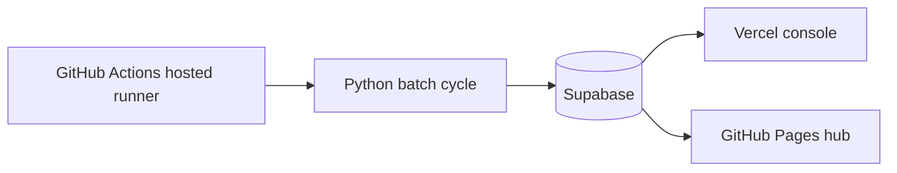

# System Architecture

> [Prev: Quick Start](https://github.com/sheryloe/Automethemoney/wiki/Quick-Start) | [Wiki Home](https://github.com/sheryloe/Automethemoney/wiki) | [Next: Console Screens](https://github.com/sheryloe/Automethemoney/wiki/Console-Screens)

---

Current production baseline is **GitHub Actions (hosted) + Supabase + Vercel + GitHub Pages**.

## Layer ownership

| Layer | Responsibility |
| --- | --- |
| GitHub Actions (hosted) | Executes scheduled `cloud-cycle` batch jobs |
| Python engine | Generates setups, updates paper positions and PnL |
| Supabase | Stores runtime state and diagnostics |
| Vercel | Serves operator console and settings API |
| GitHub Pages | Serves public service hub and setup guide |

## Flow

## Runtime policy

- `TRADE_MODE=paper`
- `ENABLE_LIVE_EXECUTION=false`
- `LIVE_ENABLE_CRYPTO=false`
- `BYBIT_READONLY_SYNC=true`
- `BYBIT_SECRET_SOURCE=github`
- `RUNNER_ROLE=github-hosted`

## Diagnostic keys

Use `engine_heartbeat.meta_json` for first diagnosis:

- `runner`
- `trade_mode`
- `bybit_preflight_public_status`
- `bybit_preflight_auth_status`
- `bybit_preflight_error`
- `last_bybit_sync_ts`