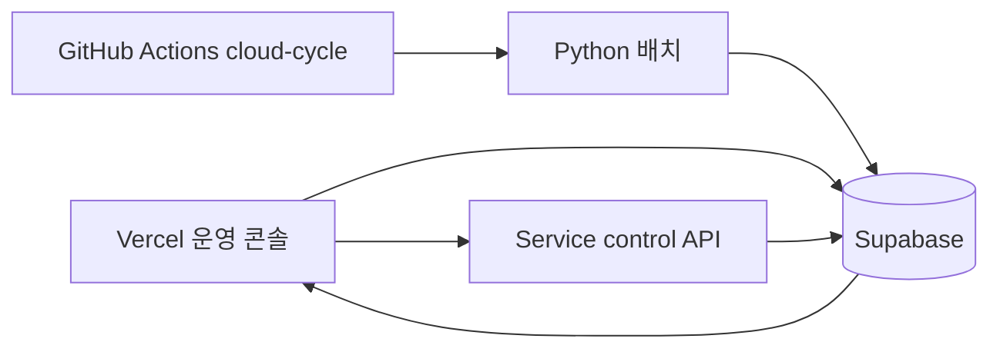

# 시스템 아키텍처

AI_Auto는 단일 서버가 모든 일을 맡는 구조가 아니라, 운영 콘솔과 상태 저장과 배치 실행을 분리한 서비스형 구조입니다.

## 레이어별 역할

| 레이어 | 담당 역할 | 운영 포인트 |
| --- | --- | --- |
| Vercel | 운영 콘솔 UI, Service control API | `/settings` 저장과 화면 렌더링 |
| Supabase | 상태 원장, provider vault, runtime profile | heartbeat, setup, 포지션, 일별 PnL 저장 |
| Python 배치 | 분석, intrabar 체결 판정, PnL 계산, autotune | 실제 전략 로직과 데모 체결 처리 |
| GitHub Actions | `cloud-cycle` 스케줄 실행 | 8분 주기, 중복 실행 방지, 일별 commit/push |

## 아키텍처 다이어그램

> 화면, 상태 저장, 배치 실행을 분리해 두면 문제를 찾을 때 어디부터 봐야 하는지가 훨씬 분명해집니다.

### Vercel

- 운영 콘솔 UI 제공
- `/`, `/models`, `/positions`, `/settings` 화면 제공
- Service control API 라우트 제공
- provider 저장과 runtime 저장 요청 처리

### Supabase

- heartbeat 저장
- model setup 저장
- 포지션 상태 저장
- 일별 PnL 저장
- runtime tune 상태 저장
- provider vault 암호화 저장
- runtime profile 저장

### Python 배치

- planner 모델 분석
- intrabar 체결 판정
- 포지션 업데이트
- 일별 PnL 계산
- autotune 실행

### GitHub Actions

- `cloud-cycle` 8분 주기 실행
- daily report commit / push
- 배치 실행 자동화

## 운영자가 아키텍처를 읽을 때 보는 순서

- [ ] 화면이 안 뜨면 `Vercel`
- [ ] 데이터가 안 보이면 `Supabase`
- [ ] 분석/체결 결과가 이상하면 `Python 배치`
- [ ] 8분 실행이 안 돌면 `GitHub Actions`

## 왜 이렇게 나눴는가

이 구조의 장점은 장애 원인을 레이어별로 좁히기 쉽다는 점입니다.

- 화면 문제는 Vercel
- 상태 저장 문제는 Supabase
- 분석/체결 시뮬레이션 문제는 Python 배치
- 주기 실행 문제는 GitHub Actions

단일 Flask 앱에 모든 것을 넣으면 편해 보이지만, 실제 운영에서는 원인 추적과 리셋 정책이 훨씬 어려워집니다.

## 현재 아키텍처의 성격

- 실시간 틱 엔진이 아니라 운영 가능한 배치형 데모
- futures 기준 운영
- provider 키는 GitHub가 아니라 service vault 중심으로 관리
- 실거래 전환은 별도 가드 아래에서 검증해야 함
