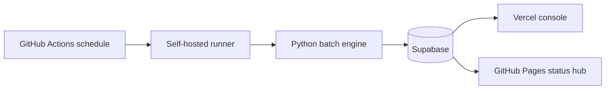

# 시스템 아키텍처

> [Prev: Quick Start](https://github.com/sheryloe/Automethemoney/wiki/Quick-Start) | [Wiki Home](https://github.com/sheryloe/Automethemoney/wiki) | [Next: Console Screens](https://github.com/sheryloe/Automethemoney/wiki/Console-Screens)

---

현재 운영 기준은 **Self-hosted Runner + Supabase + Vercel + GitHub Pages**입니다.

## 레이어별 역할

| 레이어 | 역할 | 핵심 테이블/자원 |
| --- | --- | --- |
| Self-hosted Runner (`cloud-cycle`) | 1분 주기 배치 실행, 시그널/포지션 계산 | `scripts/run_batch_cycle.py` |
| Supabase | 상태 원장 및 런타임 저장소 | `engine_heartbeat`, `model_setups`, `positions`, `daily_model_pnl` |
| Vercel | 운영 콘솔 UI/API | `/`, `/models`, `/positions`, `/settings` |
| GitHub Pages | 운영문서 + 상태허브 + Daily PnL 뷰 | `docs/index.html`, `docs/daily-pnl.html` |

## 데이터 흐름

## 운영 정책

- 실행 모드: `paper`
- 실거래: `ENABLE_LIVE_EXECUTION=false`
- Bybit 동기화: `BYBIT_READONLY_SYNC=true` (읽기 전용)
- 키 우선순위: `BYBIT_SECRET_SOURCE=github`
- 고정 심볼 모드: `CRYPTO_UNIVERSE_MODE=fixed_symbols`

## 실패 시 원인 분리

`engine_heartbeat.meta_json`에서 아래 키를 우선 확인합니다.

- `runner`
- `bybit_preflight_public_status`
- `bybit_preflight_auth_status`
- `bybit_preflight_error`
- `last_bybit_sync_ts`