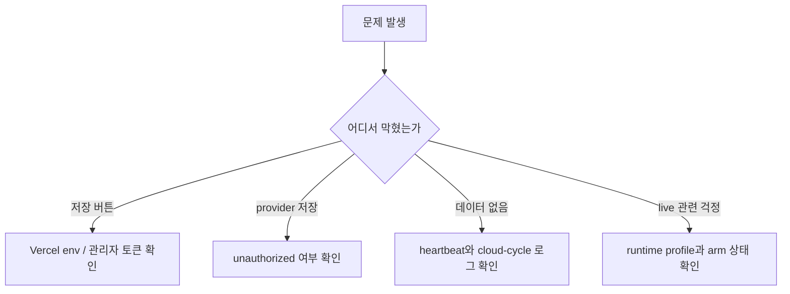

# 트러블슈팅

> [Prev: Operations Guide](https://github.com/sheryloe/AutoTrading_ing....-/wiki/Operations-Guide) | [Wiki Home](https://github.com/sheryloe/AutoTrading_ing....-/wiki)

---

운영 중 자주 막히는 증상과 점검 순서를 짧게 모아둔 페이지입니다.

## 자주 보는 문제 요약

| 증상 | 가장 먼저 볼 것 | 주된 원인 |
| --- | --- | --- |
| `/settings` 저장 버튼이 비활성화 | Vercel env, 관리자 토큰 | `SERVICE_MASTER_KEY`/`SERVICE_ADMIN_TOKEN` 오타, redeploy 누락 |
| provider 저장 시 `unauthorized` | 관리자 토큰 입력 상태 | 토큰 불일치 또는 refresh 후 토큰 입력 누락 |
| heartbeat가 안 올라오는 것처럼 보임 | `engine_heartbeat` 시간대 | UTC와 KST 혼동 |
| GitHub Actions가 겹쳐 보임 | workflow 실행 기록 | 이전 timeout 설정 또는 중복 실행 오해 |
| Bybit 키 저장 후 바로 live가 될까 걱정됨 | runtime profile 상태 | live 가드 조건 미충족 |

## 점검 흐름 다이어그램

> 대부분의 문제는 Vercel env, 관리자 토큰, GitHub Actions 실행 기록 중 하나에서 먼저 원인이 드러납니다.

## `/settings` 저장 버튼이 비활성화될 때

점검 순서:

- [ ] `SERVICE_MASTER_KEY` 이름이 정확한지 확인한다
- [ ] `SERVICE_ADMIN_TOKEN` 이름이 정확한지 확인한다
- [ ] Vercel env 수정 후 redeploy를 했는지 본다
- [ ] 현재 보고 있는 배포가 preview인지 production인지 확인한다

## provider 저장 시 `unauthorized`

이 경우는 거래소 IP 제한보다 관리자 토큰 문제일 가능성이 훨씬 큽니다.

- [ ] `/settings` 상단에서 관리자 토큰을 다시 입력한다
- [ ] Vercel의 `SERVICE_ADMIN_TOKEN` 값과 실제 입력값이 같은지 본다
- [ ] 페이지 refresh 이후 토큰 입력 상태가 유지되는지 확인한다

## Supabase에서 heartbeat가 안 보일 때

점검 순서:

1. GitHub Actions `cloud-cycle` 실행 기록 확인
2. `engine_heartbeat` 조회 시 KST/UTC 혼동 여부 확인
3. GitHub Actions 로그에서 Python 예외 확인
4. `SUPABASE_URL`, `SUPABASE_SECRET_KEY`, `SERVICE_MASTER_KEY` 값 확인

## GitHub Actions가 겹쳐 실행되는 것처럼 보일 때

현재 `cloud-cycle`은 `concurrency`가 켜져 있습니다. 실행 시간이 길어 보이더라도 실제로는 중복 실행이 아니라 이전 run 정리 중일 수 있습니다.

## provider 키 저장 후 바로 live가 되나?

아닙니다. 아래 조건이 모두 맞아야 live 전환 조건이 됩니다.

- execution target
- live execution flag
- crypto live enable
- arm
- 유효한 Bybit provider 키

## 시드 변경 후 바로 현재 포지션이 초기화되나?

아닙니다. runtime 저장은 현재 포지션을 유지하고, 시드 변경은 다음 명시적 하드 리셋 시점에 적용됩니다.
